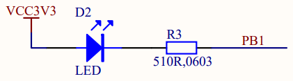
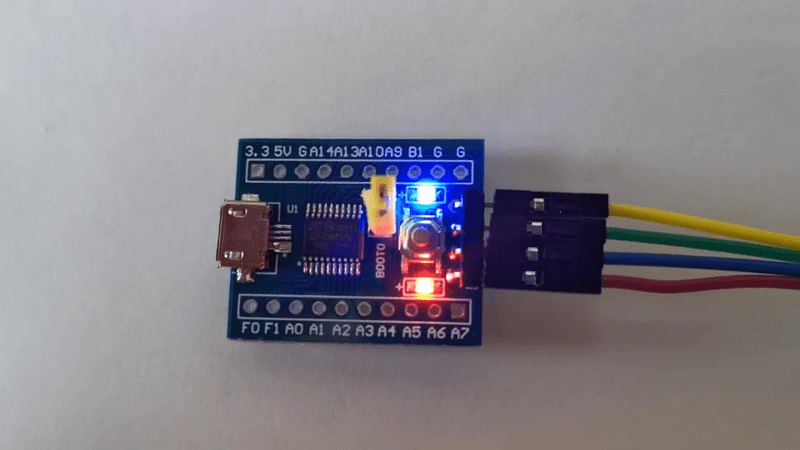

# 1.4: User LED ON

Turning the user LED on is the simplest direct feedback you can get from
a board. Most boards you can buy online have two LEDs: power and user.
In order to know where the user LED is connected and how to drive it on,
you need to know the board you are developing for.

## Meet your board

The board I am using is made by VCC-GND Studio and its specifications
can be found
[here](https://stm32-base.org/boards/STM32F030F4P6-VCC-GND.html). Taking
a look at the schematics we can see that the user LED is connected to
GPIO B1 and will turn on when that pin is driven low.



This board is based on the micro-controller STM32F030F4P6, so let's
learn about its implementation of GPIOs.

## Know your chipset

From the datasheet
[DS9773](https://www.st.com/content/st_com/en/search.html#q=DS9773-t=resources-page=1)
we learn that pin 14 of the 20 pin package defaults as PB1 after reset.
It's a 3.3V tolerant I/O pin and can be configured either as an output,
an input or one of several alternate functions. The GPIO peripherals are
connected on the AHB2 Bus which means that they can be controlled
through their registers visible in the AHB2 sub-range of the Peripherals
range of address. For GPIO B, that means the address range 0x48000400 to
0x480007FF.

Diving in the reference manual
[RM0360](https://www.st.com/content/st_com/en/search.html#q=%20RM0360-t=resources-page=1),
we find the layout of the GPIO B registers and their initial state plus
the info that peripheral clocks need to be enabled through the Reset and
Clock Controller (RCC) connected on the AHB1 bus. So we need to activate
the clocks of GPIO B through the RCC before we can access its registers.

To turn the user LED on, we need to

- Enable the clock of GPIO B
- Configure B1 mode as an output by selecting mode 01
- Configure B1 type as a push-pull, which is the reset value (0)
- Set B1 value to 0, which is the reset value (0)

## Code and Build

I start by making a copy of **boot.c** into **ledon.c** and rework the
**Reset_Handler** to light up the LED before entering the idle loop.

```c
/* Memory locations defined by linker script */
extern long __StackTop ;        /* &__StackTop points after end of stack */
void Reset_Handler( void) ;     /* Entry point for execution */

/* Interrupt vector table:
 * 1  Stack Pointer reset value
 * 15 System Exceptions
 * NN Device specific Interrupts
 */
typedef void (*isr_p)( void) ;
isr_p const isr_vector[ 2] __attribute__((section(".isr_vector"))) = {
    (isr_p) &__StackTop,
/* System Exceptions */
    Reset_Handler
} ;

#define RCC                 ((volatile long *) 0x40021000)
#define RCC_AHBENR          RCC[ 5]
#define RCC_AHBENR_IOPBEN   0x00040000  /*  18: I/O port B clock enable */

#define GPIOB               ((volatile long *) 0x48000400)
#define GPIOB_MODER         GPIOB[ 0]

void Reset_Handler( void) {
/* User LED ON */
    RCC_AHBENR |= RCC_AHBENR_IOPBEN ;   /* Enable IOPB periph */
    GPIOB_MODER |= 1 << (1 * 2) ;       /* PB1 Output [01], over default 00 */
    /* OTYPER Push-Pull by default */
    /* PB1 output default LOW at reset */
    for( ;;) ;
}
```

- I use the C preprocessor to specify the mapping of the peripheral
registers.

- The naming convention is from the Reference Manual, the address
locations from the Data Sheet.

- Registers are indicated as volatile as they may change out of the code
control, this way the compiler will avoid optimizations based on known
states.

To build I just request the format I need, either **.bin** or
**.hex**.

```
$ make ledon.hex
ledon.elf
   text    data     bss     dec     hex filename
     40       0       0      40      28 ledon.elf
ledon.hex
```

## Test

Once the board has been flashed with this code, the user LED lights up
at reset. It turns out to be blue. 😎



## Checkpoint

We covered the basic of GPIO output programming by turning the user LED
on.

[Next](15_blink) I will implement the classic blinking LED.

___
© 2020-2021 Renaud Fivet

