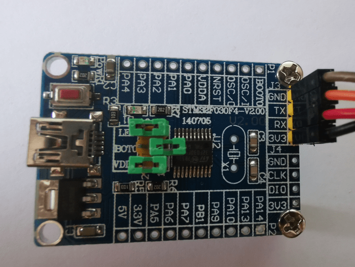
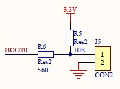

# 2.1: UART Validation

Before I start writing some code doing communication over the Universal
Synchronous Asynchronous Receiver Transmitter (USART) peripheral, I need
to validate that I have working hardware and software tools.

## Board Connectivity

Even if the peripheral is capable of doing synchronous communication
(that’s the S in USART), asynchronous communication (that’s the A) which
only needs 3 wires (GND, TX, RX, (no clock)) is usually what is needed
in non specialized cases.

Boards sold online often have dedicated pre-soldered pins for UART
connectivity similar to what we have seen before for the SWD interface.
The VCC-GND board I used before doesn’t have such dedicated pins but the
functionality is wired on the pins PA9 (TX) and PA10 (RX).

I will use a board with dedicated pins (GND, TX, RX, VCC 3.3V).

## USB to UART adapter

An adapter is needed to connect to a PC. Either due to difference in
voltage (RS232) or serial protocol (USB). Pins PA9 and PA10 are 5V
tolerant, so you could interface an Arduino Uno to a STM32 board to use
it as a USB to serial adapter if you happen to have a spare Arduino Uno.

I use a [Waveshare PL2303 USB](
https://www.waveshare.com/pl2303-usb-uart-board-mini.htm) to UART
adapter. It’s based on a Prolific PL2303TA chipset. Latest Windows USB
driver for the PL2303 can be found on Prolific website. The adapter
enumerates as COM4 on my Windows PC.

I configure the jumper of the adapter to provide 3.3V and make sure to
cross RX and TX while connecting the adapter to the board (STM32 RX <->
Adapter TX, STM32 TX <-> Adapter RX).

## STM32 Cube Programmer UART connection

So far I have been using the ST-Link interface with STM32 Cube
Programmer to flash and debug. The application also support the UART
interface.

## Embedded Boot Loader

A reset of the board while jumper BOOT0 is removed will select the
System memory instead of the flash memory for execution. This is where
the serial flash loader protocol is implemented on chipset side.

## Testing

The checklist goes like this

- Board connected to USB adapter

- USB driver installed on Windows PC

- USB adapter plugged in and enumerates as a COM port

- STM32 Cube Programmer list the COM port in device selection menu

- BOOT0 jumper removed and board reset to start the embedded flash
loader.

- Board flash memory can be erased, written or read with the programmer.

## Checkpoint

I have now working hardware and software that communicate through the
serial link.

[Next]( https://warehouse.motd.org/?page_id=514) I will insure the code
I wrote so far is working on the new board.

___
© 2020-2021 Renaud Fivet
