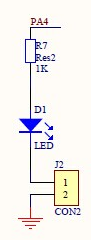

# 2.2 Another Day, Another Board

As I switched to a new board, I need to check that the code I wrote so
far is still working as expected. Unfortunately the user LED on the new
board is wired differently than the first one.

## Board Schematics



The new board uses **PA4** to turn the LED ON when **high**. Also, by
taking off a jumper, **PA4** can be used for other purposes.

The first board uses **PB1** to turn the LED ON when **low** as we can
see [here]( 14_ledon).

I can adapt the code by adding the base address of **GPIOA** and
shifting pin location accordingly, but this type of variations is so
common that I want to make sure adaptations can be done easily without
errors.

## Board Description

I want to be able to capture the board variations through simple definitions:

```
#define LED_IOP A
#define LED_PIN 4
#define LED_ON  1
```

And for the vcc-gnd board:

```
#define LED_IOP B
#define LED_PIN 1
#define LED_ON  0
```

## Implementation

I make a copy of **init.c** into **board.c** and rework the preprocessor
macroes.

As we have several GPIO peripheral GPIOA .. GPIOF, I switch notation,
instead of writing, say, `GPIOA_MODER`, I will write either `GPIOA[ MODER]`
or `GPIO( A)[ MODER]`. This way I could refer directly to `GPIO( LED_IOP)[
MODER]`.

I use conditional compilation based on `LED_ON`. If `LED_ON` is high, I need
an extra step during initialization compare to `LED_ON` low. On the other
hand, if `LED_ON` is undefined, the code would be removed for a board that
doesn’t have a user LED.

```c
#define SYSTICK             ((volatile long *) 0xE000E010)
#define SYSTICK_CSR         SYSTICK[ 0]
#define SYSTICK_RVR         SYSTICK[ 1]
#define SYSTICK_CVR         SYSTICK[ 2]

#define CAT( a, b) a##b
#define HEXA( a) CAT( 0x, a)
#define RCC                 ((volatile long *) 0x40021000)
#define RCC_AHBENR          RCC[ 5]
#define RCC_AHBENR_IOP( h)  (1 << (17 + HEXA( h) - 0xA))

#define GPIOA               ((volatile long *) 0x48000000)
#define GPIOB               ((volatile long *) 0x48000400)
#define GPIO( x) CAT( GPIO, x)
#define MODER   0
#define ODR     5

/* user LED ON when PA4 is high */
#define LED_IOP A
#define LED_PIN 4
#define LED_ON  1

void SysTick_Handler( void) {
#ifdef LED_ON
    GPIO( LED_IOP)[ ODR] ^= 1 << LED_PIN ;   /* Toggle User LED */
#endif
}

int init( void) {
/* By default SYSCLK == HSI [8MHZ] */

/* SYSTICK */
    SYSTICK_RVR = 1000000 - 1 ;     /* HBA / 8 */
    SYSTICK_CVR = 0 ;
    SYSTICK_CSR = 3 ;               /* HBA / 8, Interrupt ON, Enable */
    /* SysTick_Handler will execute every 1s from now on */

#ifdef LED_ON
/* User LED ON */
    RCC_AHBENR |= RCC_AHBENR_IOP( LED_IOP) ;        /* Enable IOPx periph */
    GPIO( LED_IOP)[ MODER] |= 1 << (LED_PIN * 2) ;  /* LED_IO Output [01],
                                                    ** over default 00 */
    /* OTYPER Push-Pull by default */
    /* Pxn output default LOW at reset */
# if LED_ON
    SysTick_Handler() ;
# endif
#endif
    return 0 ;
}
```

## Build and Test

I just need to add the `SRCS` definition in **Makefile**.

`SRCS = startup.c board.c success.c`

and build.

```
$ make
f030f4.elf
   text    data     bss     dec     hex filename
    224       0       0     224      e0 f030f4.elf
f030f4.hex
f030f4.bin
```

Once I have flashed the board with this new binary, I put back the BOOT0
jumper and press reset. This board user LED is red. 😎

## Checkpoint

I made sure the code I have evolved so far works on the board with the
serial connection.

Next I will do some serial transmission.

___
© 2020-2021 Renaud Fivet
