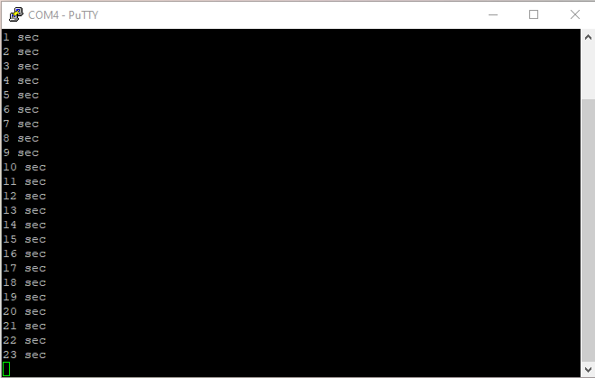

# 2.5: uptime prototype

With the basic functionality available so far, I can write something in
the vein of the Unix `uptime` command.

```
$ man -k uptime
uptime (1)           - Tell how long the system has been running.
```

I am going to make a quick prototype first to validate the concept.

## Implementation

I already have a one second based System Tick interrupt routine, so I
just need to make sure it updates a count of seconds. I make a copy of
**usart1tx.c** as **uplow.1.c** to make the changes. I use a number
suffix for the filename when I anticipate making several revisions.

```c
volatile unsigned uptime ;  /* seconds elapsed since boot */

#ifdef LED_ON
static void userLEDtoggle( void) {
    GPIO( LED_IOP)[ ODR] ^= 1 << LED_PIN ;   /* Toggle User LED */
}
#endif

void SysTick_Handler( void) {
    uptime += 1 ;
#ifdef LED_ON
    userLEDtoggle() ;
#endif
}
```

The global variable `uptime` is marked `volatile`, the compiler needs
this information to avoid optimization as the value changes concurrently
when an interrupt is triggered.

I move the user LED toggling code to a dedicated local function
`userLEDtoggle()` as this is not the only task of `SysTick_Handler()`
anymore and a call to toggle the LED is needed during initialization. I
adjust the initialization code accordingly.

I write a first **uptime.1.c** to print the count of seconds every time
the `uptime` counter value changes.

```c
/* uptime.1.c -- tells how long the system has been running */
#include <stdio.h>

extern volatile unsigned uptime ;
extern void kputc( unsigned char c) ;

void kputu( unsigned u) {
    unsigned r = u % 10 ;
    u /= 10 ;
    if( u)
        kputu( u) ;

    kputc( '0' + r) ;
}

int main( void) {
    static unsigned last ;

    for( ;;)
        if( last != uptime) {
            last = uptime ;
            kputu( last) ;
            puts( " sec") ;
        } else
            __asm( "WFI") ; /* Wait for System Tick Interrupt */
}
```

As before for `kputc()`, the implementation of `kputu()` to print an
unsigned integer in decimal format is not optimal but it is functional.

## Build

I update **Makefile** with the composition.

`SRCS = startup.c uplow.1.c uptime.1.c`

Unfortunately, when I try to build an executable, the link phase fails.

```
$ make
f030f4.elf
D:\Program Files (x86)\GNU Arm Embedded Toolchain\9 2020-q2-update\bin\arm-none-
eabi-ld.exe: uptime.1.o: in function `kputu':
D:\Projects\stm32bringup/uptime.1.c:8: undefined reference to `
__aeabi_uidivmod'
D:\Program Files (x86)\GNU Arm Embedded Toolchain\9 2020-q2-update\bin\arm-none-
eabi-ld.exe: D:\Projects\stm32bringup/uptime.1.c:9: undefined r
eference to `__aeabi_uidiv'
make: *** [Makefile:55: f030f4.elf] Error 1
```

The compiler has generated code that references two functions
`__aeabi_uidivmod` and `__aeabi_uidiv` when compiling the lines 8 and 9
of **uptime.1.c**.

```c
    unsigned r = u % 10 ;
    u /= 10 ;
```

This happens because the compiler generates code for Cortex-M0 which has
no integer division support. So integer division needs to be implemented
by code as it is not supported by hardware.

I need to pass the linker a reference to GNU Arm Embedded Toolchain
library for Cortex-M0. The library file is **libggc.a**, the option -l and
-L of the linker tell what the library name is (-lgcc => libgcc.a) and
where to look for it.

```make
LIBDIR  = $(GCCDIR)/lib/gcc/arm-none-eabi/9.3.1/thumb/v6-m/nofp
LIB_PATHS = -L$(LIBDIR)
LIBS = -lgcc

$(PROJECT).elf: $(OBJS)
    @echo $@
    $(LD) -T$(LD_SCRIPT) $(LIB_PATHS) -Map=$(PROJECT).map -cref -o $@ $^ $(LIBS)
    $(SIZE) $@
    $(OBJDUMP) -hS $@ > $(PROJECT).lst
```

Once the Makefile has been updated, the build finish successfully.

```
$ make
f030f4.elf
   text    data     bss     dec     hex filename
    777       0      12     789     315 f030f4.elf
f030f4.hex
f030f4.bin
```

Checking the linker produced map file, **f030f4.map**, I can see which
library (**libgcc.a**) but also which modules in the library (**_udivsi3.o** and
**_dvmd_tls.o**) have been used to resolve the symbols (`__aeabi_uidiv` and
`__aeabi_idiv0`).

```
Archive member included to satisfy reference by file (symbol)

D:/Program Files (x86)/GNU Arm Embedded Toolchain/9 2020-q2-update/lib/gcc/arm-none-eabi/9.3.1/thumb/v6-m/nofp\libgcc.a(_udivsi3.o)
                              uptime.1.o (__aeabi_uidiv)
D:/Program Files (x86)/GNU Arm Embedded Toolchain/9 2020-q2-update/lib/gcc/arm-none-eabi/9.3.1/thumb/v6-m/nofp\libgcc.a(_dvmd_tls.o)
                              D:/Program Files (x86)/GNU Arm Embedded Toolchain/9 2020-q2-update/lib/gcc/arm-none-eabi/9.3.1/thumb/v6-m/nofp\libgcc.a(_udivsi3.o) (__aeabi_idiv0)
```

## Testing

I flash the board and start execution, the output works as expected, the
first line “**1 sec**” appears one second after reset with a new line
following every second after that.



## Publish and Retest on Linux

I push the changes to the [git server](
https://git.sdf.org/rfivet/stm32bringup) then pull them back on my Linux
machine for retesting. The build fails with an error reported by the
linker.

`arm-none-eabi-ld: cannot find -lgcc`

The location of the Cortex-M0 **libgcc.a** library is in the same
subfolder as in the Windows distribution. Only the reference to the
location of the installation differs, I use absolute path for Windows
and relative path (**~/…**) for Linux. The issue seems to be that ld
doesn’t expand **~**. So I let GNU Make handle the expansion.

```make
#GCCDIR = ~/Packages/gcc-arm-none-eabi-9-2020-q2-update
 GCCDIR = $(HOME)/Packages/gcc-arm-none-eabi-9-2020-q2-update
```

## Library management

With Cortex-M0 version of **libgcc.a** available I have some extra
flexibility in handling usage of the library.

1 Work with a local copy of the **gcc** library.

- copy libgcc.a locally
- LIB_PATHS = -L.
- LIBS = -lgcc

2 Work with a local copy of the modules extracted from the **gcc**
library.

- ar x libgcc.a _udivsi3.o _dvmd_tls.o
- LIB_PATHS = -L.
- LIBS = _udivsi3.o _dvmd_tls.o

3 Work with my own library made from the needed modules extracted from
the **gcc** library.

- ar x libgcc.a _udivsi3.o _dvmd_tls.o
- ar qc libstm32.a _udivsi3.o _dvmd_tls.o
- LIB_PATHS = -L.
- LIBS = -lstm32

The `ar` command distributed by the GNU Arm embedded toolchain is the
same **GNU ar** as the Linux or Cygwin and MSYS2 distributions on
Windows. So I use my native environment implementation for convenience.
This is true for the utility commands (`ar`, `objcopy`, `objdump`,
`size`) but not for `gcc` and `ld`.

## Checkpoint

I have hacked a quick prototype of `uptime` and found an extra dependency
to Gnu Arm Embedded Toolchain: some modules included in **libgcc.a** have to
be included at link time as the chipset I am using has no support for
integer division. At this stage I will reuse the library as it is, but I
know where to look in the map file generated by the linker to find which
modules are included. If I ever need a better control of the link phase,
I can use `ar` to extract locally those modules from the library.

[Next]( 26_uptime) I will write `uptime` with a better structure.

___
© 2020-2021 Renaud Fivet

