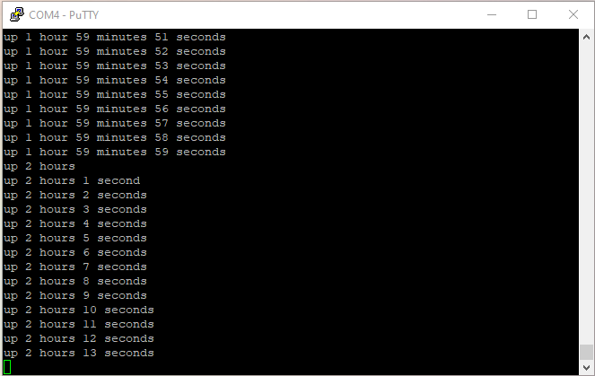

# 2.6: uptime

It’s time to throw away the prototype and write a production version of
`uptime`. There is several things I want to straighten up in
**uptime.1.c**:

- `main()` is using assembly code to wait for interrupt. Definitively not
high level C.

- Also not high level C the lines `kputu( last) ; puts( ” sec”) ;`. I
should have `printf( “%u sec\n”, last) ;` instead.

- `kputc()` function prototype and the external variable declaration for
`uptime` should be included as a C header file.

Similar to what I did when I split the functionalities between files
according to the three stages of execution (boot, init, main), I will
reorganize the code according to three categories (system, library,
application).

## System

First I make clear what the system interface is by writing the header
**system.h**. Here belong the global variables external declarations and the
function prototypes.

```c
/* system.h -- system services */

extern volatile unsigned uptime ;   /* seconds elapsed since boot */

int init( void) ;           /* System initialization, called once at startup */

void kputc( unsigned char c) ;      /* character output */
int  kputs( const char s[]) ;       /* string output */
void yield( void) ;                 /* give way */
```

Next I make a revision of **uplow.1.c** by making a copy into
**uplow.2.c**.

I include **system.h** which is the interface that **uplow.2.c**
implements. I will have several implementations of the same interface,
so **system.h** is not just the interface published by **uplow.2.c**,
it’s **uplow.2.c** which is an implementation of system.h.

```c
#include "system.h" /* implements system.h */
```

I remove the code for `puts()` as it is a library function that doesn’t
really belong to the system.

I add the implementation of `kputs()` and `yield()`.

```c
int kputs( const char s[]) {    /* string output */
    int cnt = 0 ;
    int c ;

    while( (c = *s++) != 0) {
        kputc( c) ;
        cnt += 1 ;
    }

    return cnt ;
}

void yield( void) {             /* give way */
    __asm( "WFI") ; /* Wait for System Tick Interrupt */
}
```

## Library

I create the implementation of `printf()` in **printf.c**.

- It uses the system interface **system.h**.

- I have eliminated the recursivity from my previous `kputu()` version by
adding characters at the beginning of a string.

- `kputu()` takes one additional divider parameter, so it can be used to
print unsigned integer in various format like octal, decimal and
hexadecimal. Current implementation will work for base 8 to 16, it won’t
work for binary or base 36.

- `kputi()` outputs signed integer.

- `printf()` implements a subset of the format interpreter: %%, %c, %d,
%i, %o, %s, %u, %x, %X.

```c
/* printf.c -- format and print data */
#include <stdarg.h>
#include <stdio.h>
#include "system.h" /* kputc(), kputs() */

static int kputu( unsigned u, unsigned d) {
    char s[ 12] ;                   /* room for 11 octal digit + EOS */
    char *p = &s[ sizeof s - 1] ;   /* point to last byte */

    *p = 0 ;                        /* null terminated string */
    do {
        unsigned r = u % d ;
        u /= d ;
        *--p = "0123456789ABCDEF"[ r] ;
    } while( u) ;

    return kputs( p) ;
}

static int kputi( int i) {
    int flag = i < 0 ;
    if( flag) {
        i = -i ;
        kputc( '-') ;
    }

    return flag + kputu( i, 10) ;
}

int printf( const char *fmt, ...) {
    va_list ap ;
    int cnt = 0 ;
    int c ; /* current char in format string */
    va_start( ap, fmt) ;

    while( ( c = *fmt++) != 0)
        if( c != '%') {
            cnt += 1 ; kputc( c) ;
        } else if( ( c = *fmt++) == 0) {
            cnt += 1 ; kputc( '%') ;
            break ;
        } else
            switch( c) {
            case 'c':
                cnt += 1 ; kputc( va_arg( ap, int /* char */)) ;
                break ;
            case 'o':
                cnt += kputu( va_arg( ap, unsigned), 8) ;
                break ;
            case 'u':
                cnt += kputu( va_arg( ap, unsigned), 10) ;
                break ;
            case 'x':
            case 'X':
                cnt += kputu( va_arg( ap, unsigned), 16) ;
                break ;
            case 'i':
            case 'd':
                cnt += kputi( va_arg( ap, int)) ;
                break ;
            case 's':
                cnt += kputs( va_arg( ap, char *)) ;
                break ;
            default:
                cnt += 1 ; kputc( '%') ;
                /* fallthrough */
            case '%':
                cnt += 1 ; kputc( c) ;
            }

    va_end( ap) ;
    return cnt ;
}
```

## Application

I write my final version of uptime in **uptime.c**.

- It uses the system interface and standard library.

- Instead of a count of seconds elapsed it displays a breakdown in week,
days, hours, minutes and seconds.

```c
/* uptime.c -- tells how long the system has been running */

#include <stdio.h>
#include "system.h" /* uptime, yield() */

static void display( unsigned u, const char *s) {
    if( u)
        printf( " %d %s%s", u, s, &"s"[ u <= 1]) ;
}

int main( void) {
    static unsigned last ;

    for( ;;)
        if( last != uptime) {
            unsigned w, d, h, m ,s ;

            last = uptime ;
            d = h = m = 0 ;
            s = last % 60 ;
            w = last / 60 ;
            if( w) {
                m = w % 60 ;
                w /= 60 ;
                if( w) {
                    h = w % 24 ;
                    w /= 24 ;
                    if( w) {
                        d = w % 7 ;
                        w /= 7 ;
                    }
                }
            }

            printf( "up") ;
            display( w, "week") ;
            display( d, "day") ;
            display( h, "hour") ;
            display( m, "minute") ;
            display( s, "second") ;
            printf( "\n") ;
        } else
            yield() ;   /* Wait for System Tick Interrupt */
}
```

## Build

To build I add the composition in **Makefile**.

`SRCS = startup.c uplow.2.c uptime.c printf.c`

Unfortunately, the build fails at the link phase.

```
$ make
f030f4.elf
D:\Program Files (x86)\GNU Arm Embedded Toolchain\9 2020-q2-update\bin\arm-none-eabi-ld.exe: uptime.o: in function `main':
D:\Projects\stm32bringup/uptime.c:41: undefined reference to `putchar'
make: *** [Makefile:55: f030f4.elf] Error 1
```

The linker found a reference to `putchar()` at line 41 of **uptime.c**.

```c
            printf( "\n") ;
```

I haven’t used `putchar()` in my code and line 41 is a `printf( “\n”)` that
can be optimized to a `putchar( ‘\n’)`. This must be some high level C
optimization of gcc.

I add the code for `putchar()` in **putchar.c** as it is a standard library
function.

```c
/* putchar.c -- write a character to stdout */
#include <stdio.h>
#include "system.h" /* kputc() */

int putchar( int c) {
    kputc( c) ;
    return c ;
}
```

Updating **Makefile** by adding **putchar.c** to the composition.

`SRCS = startup.c uplow.2.c uptime.c printf.c putchar.c`

The build now complete successfully.

```
$ make
f030f4.elf
   text    data     bss     dec     hex filename
   1792       0      12    1804     70c f030f4.elf
f030f4.hex
f030f4.bin
```

By checking the map file provided by the linker, I can see that the
number of low level modules referred by the code generated by the
compiler has increased. Both integer and unsigned division but also some
code to handle `switch()` statement are now referenced.

```
Archive member included to satisfy reference by file (symbol)

D:/Program Files (x86)/GNU Arm Embedded Toolchain/9 2020-q2-update/lib/gcc/arm-none-eabi/9.3.1/thumb/v6-m/nofp\libgcc.a(_thumb1_case_sqi.o)
                              printf.o (__gnu_thumb1_case_sqi)
D:/Program Files (x86)/GNU Arm Embedded Toolchain/9 2020-q2-update/lib/gcc/arm-none-eabi/9.3.1/thumb/v6-m/nofp\libgcc.a(_udivsi3.o)
                              uptime.o (__aeabi_uidiv)
D:/Program Files (x86)/GNU Arm Embedded Toolchain/9 2020-q2-update/lib/gcc/arm-none-eabi/9.3.1/thumb/v6-m/nofp\libgcc.a(_divsi3.o)
                              uptime.o (__aeabi_idiv)
D:/Program Files (x86)/GNU Arm Embedded Toolchain/9 2020-q2-update/lib/gcc/arm-none-eabi/9.3.1/thumb/v6-m/nofp\libgcc.a(_dvmd_tls.o)
                              D:/Program Files (x86)/GNU Arm Embedded Toolchain/9 2020-q2-update/lib/gcc/arm-none-eabi/9.3.1/thumb/v6-m/nofp\libgcc.a(_udivsi3.o) (__aeabi_idiv0)
```

## Test

I flash the board and start execution, the output works as expected.



It will take a while to see the days and weeks counts appear, so I will
need to power the board independently from it’s serial interface. For
test purpose I fast forward the execution by using a bigger value for
the increment of `uptime` in `SysTick_handler()`.

## Checkpoint

Rereading the code while writing this web page, I found a typo in the
week calculation. After that I retested with a bigger time increment to
make sure days and weeks values are correct. It’s also clear that the
test coverage for the format interpreter is not sufficient as I have
coded more than is necessary to implement **uptime**.

I didn’t expect gcc to optimize call to high level C functions,
replacing `printf()` by `putchar()`, thus forcing me to write additional
code. So far I am not concerned by execution speed, so this type of
optimization is a bit counter productive.

[Next]( 27_library) I will make sure that what belongs to the library
category fits in an actual library file.

___
© 2020-2021 Renaud Fivet

