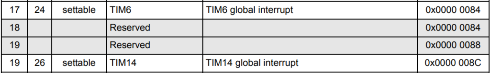

# 2.9: Interrupt Driven Transmission

It’s time to revise the implementation of `kputc()`, remove the
recursive call to handle CR LF transmission and avoid the busy wait
loop. USART1 can trigger an interrupt when the Transmit Data Register
(**TDR**) is empty which is all I need to implement interrupt driven
transmission.

## Extending the interrupt vector

I need to add the device specific interrupts to the interrupt vector. So
far I have only mapped the initial Stack pointer and the 15 Core System
Exceptions. The STF0x0 chipsets have 32 device specific interrupts which
are listed in the Reference Manual RM0360.

I make a copy of **startup.c** into **startup.txeie.c** to do the
changes. The name txeie refers to Transmit Data Register Empty Interrupt
Enabled.

```c
/* Stubs for System Exception Handler */
void Default_Handler( void) ;
#define dflt_hndlr( fun) void fun##_Handler( void) \
                                __attribute__((weak,alias("Default_Handler")))
dflt_hndlr( NMI) ;
dflt_hndlr( HardFault) ;
dflt_hndlr( SVCall) ;
dflt_hndlr( PendSV) ;
dflt_hndlr( SysTick) ;

dflt_hndlr( WWDG) ;
dflt_hndlr( RTC) ;
dflt_hndlr( FLASH) ;
dflt_hndlr( RCC) ;
dflt_hndlr( EXTI0_1) ;
dflt_hndlr( EXTI2_3) ;
dflt_hndlr( EXTI4_15) ;
dflt_hndlr( DMA_CH1) ;
dflt_hndlr( DMA_CH2_3) ;
dflt_hndlr( DMA_CH4_5) ;
dflt_hndlr( ADC) ;
dflt_hndlr( TIM1_BRK_UP_TRG_COM) ;
dflt_hndlr( TIM1_CC) ;
dflt_hndlr( TIM3) ;
dflt_hndlr( TIM6) ;
dflt_hndlr( TIM14) ;
dflt_hndlr( TIM15) ;
dflt_hndlr( TIM16) ;
dflt_hndlr( TIM17) ;
dflt_hndlr( I2C1) ;
dflt_hndlr( I2C2) ;
dflt_hndlr( SPI1) ;
dflt_hndlr( SPI2) ;
dflt_hndlr( USART1) ;
dflt_hndlr( USART2) ;
dflt_hndlr( USART3_4_5_6) ;
dflt_hndlr( USB) ;

/* Interrupt vector table:
 * 1  Stack Pointer reset value
 * 15 System Exceptions
 * 32 Device specific Interrupts
 */
typedef void (*isr_p)( void) ;
isr_p const isr_vector[ 16 + 32] __attribute__((section(".isr_vector"))) = {
    (isr_p) &__StackTop,
/* System Exceptions */
    Reset_Handler,
    NMI_Handler,
    HardFault_Handler,
    0,  0,  0,  0,  0,  0,  0,
    SVCall_Handler,
    0,  0,
    PendSV_Handler,
    SysTick_Handler,
/* STM32F030xx specific Interrupts cf RM0360 */
    WWDG_Handler,
    0,
    RTC_Handler,
    FLASH_Handler,
    RCC_Handler,
    EXTI0_1_Handler,
    EXTI2_3_Handler,
    EXTI4_15_Handler,
    0,
    DMA_CH1_Handler,
    DMA_CH2_3_Handler,
    DMA_CH4_5_Handler,
    ADC_Handler,
    TIM1_BRK_UP_TRG_COM_Handler,
    TIM1_CC_Handler,
    0,
    TIM3_Handler,
    TIM6_Handler,
    0,
    TIM14_Handler,
    TIM15_Handler,
    TIM16_Handler,
    TIM17_Handler,
    I2C1_Handler,
    I2C2_Handler,
    SPI1_Handler,
    SPI2_Handler,
    USART1_Handler,
    USART2_Handler,
    USART3_4_5_6_Handler,
    0,
    USB_Handler
} ;
```

Pay attention when checking the reference manual RM0360 list of
interrupts, it is misleading.



There is only one reserved position between TIM6 and TIM14, the table
shows two lines with entry 19 and two lines with address 0x00000084. I
am using Rev 4 of RM0360, the latest version I could find online.

## kputc() and USART1_Handler()

I make a copy of **clocks.c** into **txeie.c** to make the changes to my
system layer.

I add the description of the TX Empty Interrupt Enable bit in the
Configuration Register of USART1:

`#define USART_CR1_TXEIE (1 << 7)    /* 7: TDR Empty Interrupt Enable */`

I use a Round Robin buffer to synchronize `kputc()` and
`USART1_Handler()` making sure they don’t write to the same location.

```c
static unsigned char txbuf[ 8] ; // best if size is a power of 2 for cortex-M0
#define TXBUF_SIZE (sizeof txbuf / sizeof txbuf[ 0])
static unsigned char            txbufin ;
static volatile unsigned char   txbufout ;
```

- `kputc()` write in `txbuf[]` while `USART1_Handler()`only read from
  it.

- `txbufin` is the index of the position where `kputc()` will insert a
  character, it’s written by `kputc()` and read by `USART1_Handler()`.

- `txbufout` is the index of the position where `USART1_Handler()` will
  fetch a character, it’s written by `USART1_Handler()` and read by
  `kputc()`. The value of txbufout will change under interrupt, so it is
  marked as `volatile` to make sure the compiler will not optimize the
  code in a conflicting way.

- As the index calculation in the Round Robin buffer uses integer
  division, it is best that the size of the buffer be a power of two on
  Cortex-M0 chipset. This way the compiler will optimize `(idx+1) %
  size` into `(idx+1) & (size-1)`, which is more efficient on chipset
  with no support for integer division.

- I kept the buffer size small to be sure this code is well tested. With
  a value of 8, this means the buffer can hold up to 7 characters.

```c
void USART1_Handler( void) {
    if( txbufout == txbufin) {
    /* Empty buffer => Disable TXEIE */
        USART1[ CR1] &= ~USART_CR1_TXEIE ;
    } else {
        static unsigned char lastc ;
        unsigned char c ;

        c = txbuf[ txbufout] ;
        if( c == '\n' && lastc != '\r')
            c = '\r' ;
        else
            txbufout = (txbufout + 1) % TXBUF_SIZE ;

        USART1[ TDR] = c ;
        lastc = c ;
    }
}

void kputc( unsigned char c) {  /* character output */
    int nextidx ;

/* Wait if buffer full */
    nextidx = (txbufin + 1) % TXBUF_SIZE ;
    while( nextidx == txbufout)
        yield() ;

    txbuf[ txbufin] = c ;
    txbufin = nextidx ;
/* Trigger transmission by enabling interrupt */
    USART1[ CR1] |= USART_CR1_TXEIE ;
}
```

- `kputc()` enables the interrupt generation after a new character is
  inserted in the buffer.

- `USART1_Handler()` disables the interrupt generation when the buffer
  is empty.

- The conversion of LF to CR LF is done by the interrupt handler.

- `kputc()` now yields when the buffer is full.

## Unmasking USART1 interrupt

I have configured USART1 peripheral to generate an interrupt when the
transmit data register is empty, now I have to tell the Core to pay
attention to USART1 specific interrupt line.

The 32 device specific interrupts are enabled through the Nested
Vectored Interrupt Controller (NVIC). **NVIC** is a core peripheral so its
description is in the Programming Manual. Enabling is done through the
Interrupt Set-Enable Register (ISER).

Set-Enable means writing a 1 enables while writing a 0 does nothing.
Reading reports the current settings. There is a corresponding
Clear-Enable register, to disable interrupts.

```c
#define NVIC                    ((volatile long *) 0xE000E100)
#define NVIC_ISER               NVIC[ 0]
#define unmask_irq( idx)        NVIC_ISER = 1 << idx
#define USART1_IRQ_IDX          27
```

I add a call to the macro unmask_irq() after USART1 initialization.

```c
/* Unmask USART1 irq */
    unmask_irq( USART1_IRQ_IDX) ;
```

## Build and test

I add the composition into Makefile

`SRCS = startup.txeie.c txeie.c uptime.c`

Build completes successfully

```
$ make
f030f4.elf
   text    data     bss     dec     hex filename
   2096       0      20    2116     844 f030f4.elf
f030f4.hex
f030f4.bin
```

Checking the map and lst files I can verify that

- This code has grown by 128 bytes due to the extra interrupt handlers.

- Previous implementation of `kputc()` was using 4 bytes of bss to hold
  lastchar (1 byte). The new version uses 12 bytes to hold the round
  robin buffer (8 bytes), its in and out indexes (2 bytes) and lastchar
  (1 byte).

- The compiler optimizes the modulo instruction in `% size` to bit
  masking `& (size – 1)` as the size 8 is a power of 2.

Flashing a device with the new executable, **uptime** works as the previous
version.

## Checkpoint

There is no obvious benefit in doing transmission under interrupt at
this stage, my most complex application, **uptime**, prints one line
every second, there is plenty of idle time.

[Next]( index#part3) I will use an external sensor to do some measurement.

___
© 2020-2021 Renaud Fivet
