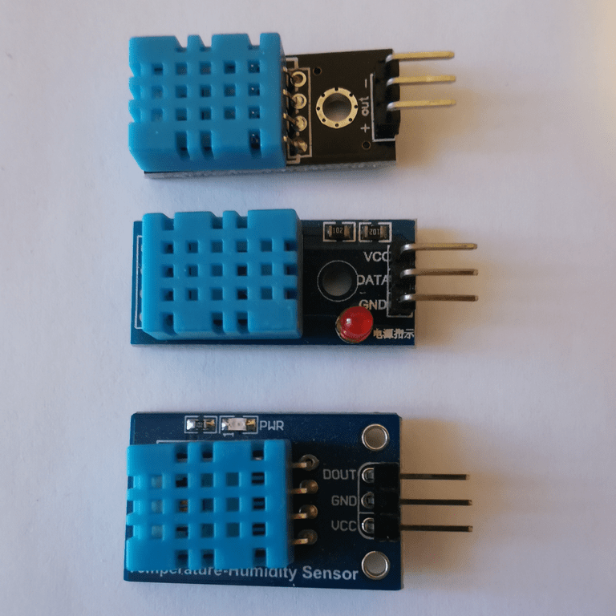
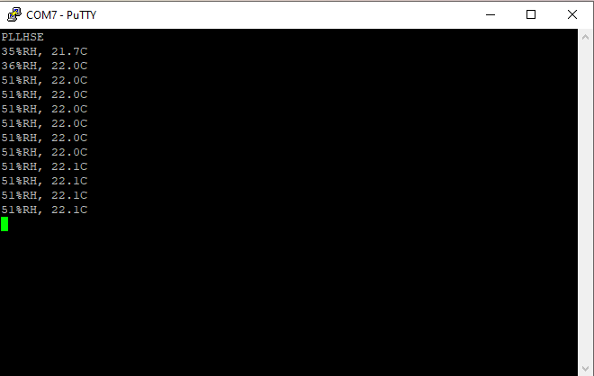

# 3.1: DHT11 Humidity & Temperature

The DHT11 is a low cost humidity and temperature sensor from Aosong
which is easy to buy online. It is not popular as it has a non standard
communication protocol and its precision is ±5% for humidity and ±2°C
for temperature so it’s often overlooked for more expensive solution.

## Hardware consideration

The DHT11 comes in a 4 pin package where only 3 pins are used: vcc, gnd
and data io. It can be powered at 5V or 3.3V. At 3.3V I can connect its
data io pin to any of the STM32 GPIO pins, if I want to test how it
behaves when powered at 5V, I will have to use one of the 5V tolerant
pin of the STM32.

The io data line when idle need to be at high level, so a pull up
resistor is necessary.

I will use 3.3V, connect DHT11 data io pin to STM32 GPIOA0. The small
DHT11 board I use has a pull up resistor between vcc and io data.



## Measurement frequency

The DHT11 needs one second to settle after power up, after that it can
be queried no more often than every two seconds.

This requirement is easy to implement based on uptime 1 second counter.

## Communication protocol

In idle state, the io data line is kept high by the pull up resistor and
DHT11 is waiting for a request.

To request data, the STM32 needs to keep the io data line at low level
for more than 18 ms.

Once the STM32 releases the line, the pull up will bring the level back
to up and the DHT11 will assert the beginning of transmission by pulling
it down for 80 µs than up for 80 µs.

The DHT11 will transmit 40 bits (5 bytes), high bit first, encoding a
zero as 50 µs low followed by 26-28 µs high and a one as 50 µs low
followed by 70 µs high.

The last bit is followed by 50 µs low to signal the end of transmission
and the return to idle state.

To implement this protocol on STM32 side:

- GPIO pin as output low during 18 ms.

- GPIO pin as input to sample the line at a frequency that allow
  differentiation of a 26-28 µs high (encoding a zero) versus a 70 µs
  high (encoding a one).

## Data encoding

The 5 transmitted bytes hold humidity, temperature and checksum.

- Byte 0: Integer part of humidity value.

- Byte 1: Fractional part of humidity value. Equals to zero.

- Byte 2: Integer part of temperature value.

- Byte 3: One digit fractional part of temperature value. 0-9, bit 7
  indicate if temperature is below zero.

- Byte 4: Cheksum of bytes 0-3.

The STM32F030 has no support for floating point representation so I will
use ad hoc representation of the temperature value.

## Implementing Low Level API

I need to implement the following low level functionalities:

- Configure a GPIOA pin as **input**. This is the default mode of most
  GPIOA pins. In input mode the line is floating and the level can be
  read.

- Configure a GPIOA pin as **output**. The level will be asserted by
  STM32. The default output value is LOW.

- **Read** a GPIOA pin level, either HIGH or LOW.

- **Sleep** for a duration specified in µs.

This is a minimal set of function based on the known state of the
system, **GPIOA** has already been enabled as I am using serial
transmission, the pins output level default to **LOW**, so I only need to
configure the pin as an output to pull down the line.

The sleep granularity is **1 µs**, I need to assert the line LOW for at
least 18 ms, so **1 ms** or even **10 ms** granularity would be fine.

I add the following lines to **system.h** to declare the interface I am
going to implement.

```c
/* GPIOA low level API ********************************************************/

typedef enum {
        LOW = 0,
        HIGH
} iolvl_t ;

void gpioa_input( int pin) ;        /* Configure GPIOA pin as input */
void gpioa_output( int pin) ;       /* Configure GPIOA pin as output */
iolvl_t  gpioa_read( int pin) ;     /* Read level of GPIOA pin */

void usleep( unsigned usecs) ;      /* wait at least usec µs */
```

I make a copy of **txeie.c** into **gpioa.c** to implement the new API.

```c
#define IDR     4

/* GPIOA low level API ********************************************************/

void gpioa_input( int pin) {        /* Configure GPIOA pin as input */
    GPIOA[ MODER] &= ~(3 << (pin * 2)) ;    /* Apin as input [00] */
}

void gpioa_output( int pin) {       /* Configure GPIOA pin as output */
    GPIOA[ MODER] |= 1 << (pin * 2) ;       /* Apin output (over [00]) */
}

iolvl_t gpioa_read( int pin) {      /* Read level of GPIOA pin */
    return LOW != (GPIOA[ IDR] & (1 << pin)) ;
}
```

I didn’t use the GPIO Input Data Register (**IDR**) until now, so I add it
to the registers description.

`gpioa_output()` implementation is minimal. I know I am switching only
between input and output mode, so I don’t need to mask the bit field
first.

I use the System Tick to implement `usleep()`.

```c
void usleep( unsigned usecs) {      /* wait at least usec µs */
#if CLOCK / 8000000 < 1
# error HCLOCK below 8 MHz
#endif
    usecs = SYSTICK_CVR - (CLOCK / 8000000 * usecs) ;
    while( SYSTICK_CVR > usecs) ;
}
```

The System Tick generates an interrupt every second but I can read the
Current Value Register (**CVR**) to pause for smaller time period.

As I will read the sensor just after a new second count, I know that the
**CVR** value is close to maximum and I don’t need to care for a roll
over.

SysTick input clock is **HCLK/8**, this implementation will work for **HCLK**
equal to a multiple of 8 MHz (8, 16, 24, 32, 40, 48).

## DHT11 API

I create the header file **dht11.h** with the following interface.

```c
/* dht11.h -- DHT11 API */

typedef enum {
    DHT11_SUCCESS,
    DHT11_FAIL_TOUT,
    DHT11_FAIL_CKSUM
} dht11_retv_t ;


/* 5 .. 95 %RH, -20 .. 60 °C */
extern unsigned char dht11_humid ;  /* 5 .. 95 %RH */
extern   signed char dht11_tempc ;  /* -20 .. 60 °C */
extern unsigned char dht11_tempf ;  /* .0 .. .9 °C */


void dht11_init( void) ;
dht11_retv_t dht11_read( void) ;
```

Usage:

- Initialization: `dht11_init()`, once at startup.

- Call: `dht11_read()`, not more often than every two seconds, starting
  one second after voltage stabilizes.

- Test for error: transmission protocol is based on strict timing and
  data integrity is insured by checksum, so Timeout and Checksum error
  need to be checked.

- Measurement available through global variables holding humidity,
  integer part of temperature and one digit fractional part of
  temperature.

Based on this API, I write **dht11main.c**.

```c
/* dht11main.c -- sample DHT11 sensor */
#include <stdio.h>

#include "system.h"
#include "dht11.h"

int main() {
    static unsigned last ;

    dht11_init() ;
    for( ;;)
        if( last == uptime)
            yield() ;
        else {
            last = uptime ;
            if( last & 1)   /* every 2 seconds starting 1 second after boot */
                switch( dht11_read()) {
                case DHT11_SUCCESS:
                    printf( "%u%%RH, %d.%uC\n", dht11_humid, dht11_tempc, dht11_tempf) ;
                    break ;
                case DHT11_FAIL_TOUT:
                    puts( "Timeout") ;
                    break ;
                case DHT11_FAIL_CKSUM:
                    puts( "Cksum error") ;
                }
        }
}
```

## DHT11 API implementation

I first translate the specs into **pseudocode**.

```c
dht11_retv_t dht11_read( void) {
    unsigned char values[ 5] ;

/* Host START: pulls line down for > 18ms then release line, pull-up raises to HIGH */
    dht11_output() ;
    usleep( 18000) ;
    dht11_input() ;

/* DHT START: takes line, 80µs low then 80µs high */
    wait_level( LOW) ;  /* HIGH -> LOW, starts 80µs low */
    wait_level( HIGH) ; /* LOW -> HIGH, ends 80µs low, starts 80µs high */

/* DHT transmits 40 bits, high bit first
 *  0 coded as 50µs low then 26~28µs high
 *  1 coded as 50µs low then 70µs high
 */
    wait_level( LOW) ; /* HIGH -> LOW, ends 80µs high, starts 50µs low */

    unsigned char sum = 0 ;
    unsigned char v = 0 ;
    for( int idx = 0 ; idx <= 4 ; idx += 1) {
        sum += v ;
        v = 0 ;
        for( unsigned char curbit = 128 ; curbit ; curbit >>= 1) {
        /* Measure duration of HIGH level */
            wait_level( HIGH) ; /* LOW -> HIGH, ends 50µs low, starts timed high */
            wait_level( LOW) ;  /* HIGH -> LOW, timed high ends, starts 50µs low */
        /* Set bit based on measured HIGH duration */
            if( duration is 70µs)  /* 0 == 26~28µs, 1 == 70µs */
                v |= curbit ;
        }

        values[ idx] = v ;
    }

/* DHT STOP: releases line after 50µs, pull-up raises to HIGH */
    wait_level( HIGH) ; /* LOW -> HIGH, ends 50µs low, dht has released the line */

    if( sum != values[ 4])
        return DHT11_FAIL_CKSUM ;

    dht11_humid = values[ 0] ;
    dht11_tempc = values[ 2] ;
    dht11_tempf = values[ 3] ;
    if( dht11_tempf & 0x80) {
        dht11_tempc *= -1 ;
        dht11_tempf &= 0x7F ;
    }

    return DHT11_SUCCESS ;
}
```

To turn this pseudocode into real implementation I need to code

- `wait_level()`: wait for a line transmission and triggers a timeout if
  there is none.

- a way to measure the duration of a HIGH level.

I implement `wait_level()` as a macro, triggering a timeout when the
number of retries reach a limit. Originally, I set MAX_RETRIES to 999,
later I tune it to be large enough for the highest frequency supported
by STM32F030 (48 MHz).

```c
#define MAX_RETRIES 200         /* at 48 MHz, 160 retries for 80 µs HIGH */
#define is_not_LOW( a) a != LOW
#define is_not_HIGH( a) a == LOW
#define wait_level( lvl) \
    retries = MAX_RETRIES ; \
    while( is_not_##lvl( dht11_bread())) \
        if( retries-- == 0) \
            return DHT11_FAIL_TOUT
```

`wait_level()` allows me to measure the duration of a wait in retries
unit. As DHT11 starts transmission by 80µs LOW followed by 80µs HIGH, I
can measure 80µs in retries unit. This is all I need to calibrate the
measurement.

I can do this calibration every time the DHT11 starts transmission, this
way I don’t need to update some constant if I change the frequency of my
system clock.

```c
/* DHT transmits 40 bits, high bit first
 *  0 coded as 50µs low then 26~28µs high
 *  1 coded as 50µs low then 70µs high
 */
    wait_level( LOW) ; /* HIGH -> LOW, ends, 80µs high, starts 50µs low */
    int threshold = (MAX_RETRIES + retries) / 2 ;
```

Based on the measured duration of 80µs, I can defined a threshold at
40µs. Later to identify if a bit transmitted was a 0 (26~28µs) or a 1
(70µs), I will check if its duration is below or higher than the
threshold.

```c
            wait_level( LOW) ;  /* HIGH -> LOW, timed high ends, starts 50µs low */
        /* Set bit based on measured HIGH duration */
            if( retries < threshold)    /* 0 == 26~28µs, 1 == 70µs */
                v |= curbit ;
```

To finalize `dht11_read()`, I declare retries before the first
`wait_level()`.

```c
/* DHT START: takes line, 80µs low then 80µs high */
    int retries ;       /* retry counter */
    wait_level( LOW) ;  /* HIGH -> LOW, starts 80µs low */
```

There is still a bit of pseudocode left as I need to map
`dht11_input()`, `dht11_output()` and `dht11_bread()` to actual GPIO
peripheral, pin and low level functions. I am using GPIOA pin 0.

```c
/* dht11.c -- DHT11 humidity and temperature sensor reading */

#include "dht11.h"      /* implements DHT11 API */

#include "system.h"     /* usleep(), gpioa_*() */


#define DIO 0

#define dht11_input()   gpioa_input( DIO)
#define dht11_output()  gpioa_output( DIO)
#define dht11_bread()   gpioa_read( DIO)

/* 5 .. 95 %RH, -20 .. 60 °C */
unsigned char dht11_humid ; /* 5 .. 95 %RH */
  signed char dht11_tempc ; /* -20 .. 60 °C */
unsigned char dht11_tempf ; /* .0 .. .9 °C */

void dht11_init( void) {
    dht11_input() ;
}
```

After adding the includes, global variables declarations and the
implementation of `dht11_init()`, I can build and test.

## Build and basic test

I add the new composition to **Makefile**

`SRCS = startup.txeie.c gpioa.c dht11main.c dht11.c`

Build completes successfully

```
$ make
f030f4.elf
   text    data     bss     dec     hex filename
   1860       0      24    1884     75c f030f4.elf
f030f4.hex
f030f4.bin
```

Flashing the board and starting execution, I can see a new output every
two seconds.



The humidity value seems off the mark. So I need to investigate what’s
the issue.

## Checkpoint

I have implemented DHT11 protocol using polling and auto calibration. I
can read the values reported by the DHT11 sensor.

[Next]( https://warehouse.motd.org/?page_id=849) I will investigate if
the values read are correct.

___
© 2020-2021 Renaud Fivet

