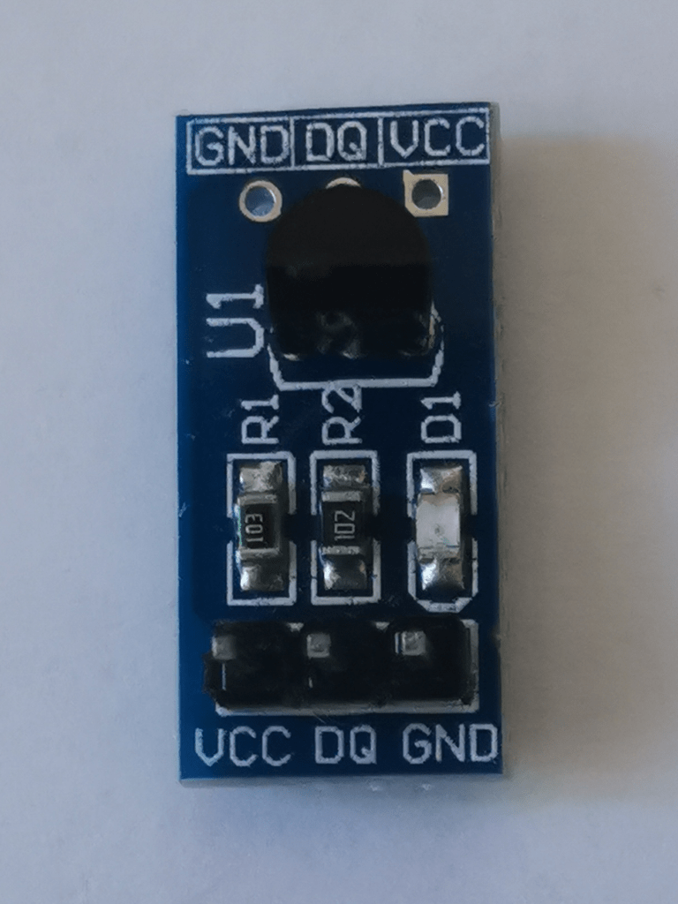
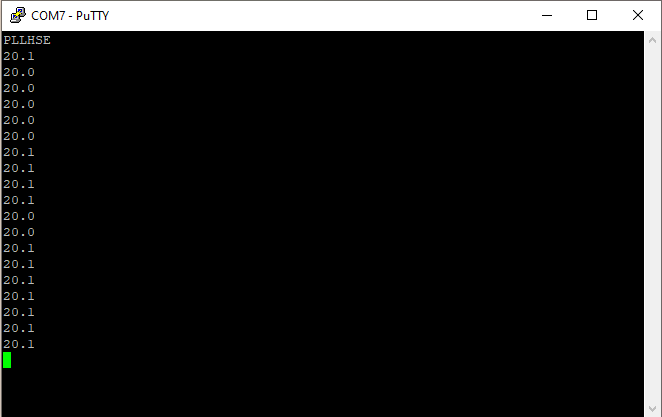

# DS18B20 Digital Thermometer

The DS18B20 chip from Maxim Integrated is a digital thermometer able to
do measurement from -55℃ to 125℃ with a precision of ±0.5℃ in the range
-10℃ to 85℃.

## Hardware considerations

The DS18B20 comes in several packaging where only 3 pins are used: vcc,
gnd and data io. It can be powered at 5V or 3.3V.

The io data line when idle need to be at high level, so a pull up
resistor is necessary. The small DS18B20 board I use has a pull up
resistor between vcc and io data.



It is possible to power the chip using data io and gnd only (no vcc) in
Parasitic Power Mode if a two wire only interface is needed. I won’t use
this feature for now.

## Communication protocol

The data io line is a 1-Wire bus on which several 1-Wire devices can be
connected. So there is a scheme to address multiple devices, but in
simple case where there is only the host and one device, command can be
broadcasted without specifying addresses.

A typical transaction sequence goes like this

- Initialization

- ROM Command (followed by any required data exchange)

- Function Command (followed by any required data exchange)

The **initialization** is a simple timed handshake where the host
triggers a response from the device by pulling the line LOW for 480µs,
then waits for the device to assert it LOW to confirm its presence.

```c
static ds18b20_retv_t initialization() {
/* Reset */
    output() ;          /* Wire LOW */
    usleep( 480) ;
    input() ;           /* Wire floating, HIGH by pull-up */

/* Presence */
    int retries ;
    wait_level( HIGH) ; /* Pull-up LOW -> HIGH, T1 */
    wait_level( LOW) ;  /* DS18B20 asserts line to LOW, T2, T2 - T1 = 15~60us */
    wait_level( HIGH) ; /* DS18B20 releases lines, Pull-up LOW -> HIGH, T3
                        **  T3 - T2 = 60~240us */
    usleep( 405) ;      /* 480 = 405 + 15 + 60 */

    return DS18B20_SUCCESS ;
}
```

The **ROM Command** is how the host selects the device for communication.
Writing a **ROM Skip** command addresses all devices connected.

The **Function Command** is the request to the device selected by the ROM
Command:

- Read the device memory

- Write the device memory

- Start a temperature conversion

To write command or data the host does timed pulse for each bit, there
is no acknowledge from the device and no error detection.

```c
static void write( unsigned char uc) {
/* Transmit byte, least significant bit first */
    for( unsigned char curbit = 1 ; curbit ; curbit <<= 1) {
    /* Transmit a bit takes 60us + 1us between transmit */
    /* Write 1: <15us LOW */
    /* Write 0:  60us LOW */
        unsigned t = uc & curbit ? 13 : 60 ;
        output() ;      /* Wire LOW */
        usleep( t) ;
        input() ;       /* Wire floating, HIGH by pull-up */
        usleep( 61 - t) ;
    }
}
```

When the host expects to read some data, it can triggers a 1 bit
transmission from the device by first pulling the line LOW for 1µs then
reading the state asserted by the device.

```c
static iolvl_t poll( void) {
    output() ;  /* Wire LOW */
    usleep( 1) ;
    input() ;   /* Wire floating, HIGH by pull-up */
    usleep( 5) ;
    iolvl_t bit = bread() ;
    usleep( 55) ;
    return bit ;
}
```

Integrity of the data transmitted by the device is guaranteed by 8 bit
Cyclic Redundancy Check (CRC).

```c
static unsigned char read( unsigned char *p, int size) {
    unsigned char crc = 0 ;

    while( size--) {
    /* Receive byte, least significant bit first */
        unsigned char uc = 0 ;
        for( unsigned char curbit = 1 ; curbit ; curbit <<= 1) {
        /* read bit */
            int v = poll() ;
            if( v)
                uc |= curbit ;

        /* update CRC */
            v ^= crc ;
            crc >>= 1 ;
            if( v & 1)
                crc ^= 0x119 >> 1 ; /* reverse POLY = x^8 + x^5 + x^4 + 1 */
        }

    /* store byte */
        *p++ = uc ;
    }

    return crc ;
}
```

Base on this, complex transaction sequences can be coded.

The transaction to read the eight byte scratchpad (device memory) plus
CRC:

```c
static ds18b20_retv_t read_scratchpad( unsigned char scratchpad[]) {
    ds18b20_retv_t ret = initialization() ;
    if( ret != DS18B20_SUCCESS)
        return ret ;

    write( 0xCC) ;  /* Skip ROM */
    write( 0xBE) ;  /* Read Scratchpad */
    return read( scratchpad, 9) ? DS18B20_FAIL_CRC : DS18B20_SUCCESS ;
}
```

## Temperature conversion and encoding

The DS18B20 can convert the temperature measured into a 12 bit signed
digit, 8 bit integer part and 4 bit fractional part. As the time of
conversion depends of the precision of the conversion, it is possible to
select the resolution from 9 to 12 significant bits. Conversion time
range from less than 93.75ms (9 bits) to maximum 750ms (12 bits).

The host requests the conversion, waits for the conversion to end, then
fetch the device memory to read the measurement.

The host can `poll()` the device to check if the conversion is finished.

## DS18B20 API

I create the header file **ds18b20.h** with the following interface.

```c
/* ds18b20.h -- 1-Wire temperature sensor */

typedef enum {
    DS18B20_SUCCESS,
    DS18B20_FAIL_TOUT,
    DS18B20_FAIL_CRC
} ds18b20_retv_t ;

void ds18b20_init( void) ;
ds18b20_retv_t ds18b20_resolution( unsigned res) ;  /* 9..12 bits  */
ds18b20_retv_t ds18b20_convert( void) ;
ds18b20_retv_t ds18b20_fetch( short *deciCtemp) ;/* -550~1250 = -55.0~125.0 C */
ds18b20_retv_t ds18b20_read( short *deciCtemp) ; /* -550~1250 = -55.0~125.0 C */
```

Usage:

- Initialization: `ds18b20_init()`, once at startup.

- Use `ds18b20_resolution()` to select the resolution. It can be done
  before starting a conversion. The value will be kept until the ds18b20
  is powered down.

- To measure the temperature, use `ds18b20_read()`, which will start a
  conversion, wait until it finishes, fetch the value from the device
  memory and deci℃ (1 deci℃ = 0.1 ℃).

- Alternatively, to avoid the blocking `ds18b20_read()`, call
  `ds18b20_convert()` followed by `ds18b20_fetch()` once enough time has
  elapsed to complete the conversion.

Below is an application to print the temperature every second.

```c
/* ds18b20main.c -- sample temperature using 1-Wire temperature sensor */

#include <stdio.h>

#include "system.h"     /* uptime */
#include "ds18b20.h"    /* ds18b20_() */

int main( void) {
    unsigned last = 0 ;

    ds18b20_init() ;
    ds18b20_resolution( 12) ;   /* Set highest resolution: 12 bits */
    ds18b20_convert() ;         /* start temperature conversion */
    for( ;;)
        if( last == uptime)
            yield() ;
        else {
            short val ;

            last = uptime ;
            switch( ds18b20_fetch( &val)) {
            case DS18B20_SUCCESS:
                printf( "%i.%i\n", val / 10, val % 10) ;
                break ;
            case DS18B20_FAIL_TOUT:
                puts( "Timeout") ;
                break ;
            case DS18B20_FAIL_CRC:
                puts( "CRC Error") ;
            }

            ds18b20_convert() ; /* start temperature conversion */
        }
}
```

## DS18B20 API implementation

I create **ds18b20.c**, starting with the GPIO mapping and
initialization.

```c
/* ds18b20.c -- 1-Wire digital thermometer */

#include "ds18b20.h"    /* implements DS18B20 API */

#include "system.h"     /* gpioa_(), usleep() */

#define DIO 13
#define input()     gpioa_input( DIO)
#define output()    gpioa_output( DIO)
#define bread()     gpioa_read( DIO)

#define MAX_RETRIES 999
#define wait_level( lvl) \
    retries = MAX_RETRIES ; \
    while( bread() != lvl) \
        if( retries-- == 0) \
            return DS18B20_FAIL_TOUT

void ds18b20_init( void) {
    input() ;           /* Wire floating, HIGH by pull-up */
}
```

I add the local functions that are the building block for the
transactions (`initialization()`, `write()`, `poll()` and `read()`) and
the `read_scratchpad()` transaction I explained before.

Start conversion transaction:

```c
ds18b20_retv_t ds18b20_convert( void) {
    ds18b20_retv_t ret ;

    ret = initialization() ;
    if( ret != DS18B20_SUCCESS)
        return ret ;

    write( 0xCC) ;  /* Skip ROM */
    write( 0x44) ;  /* Convert T */
    return DS18B20_SUCCESS ;
}
```

Fetch temperature, to be called after conversion is done.

```c
ds18b20_retv_t ds18b20_fetch( short *deciCtemp) { /* -550~1250 = -55.0~125.0 C $
    ds18b20_retv_t ret ;
    unsigned char vals[ 9] ;    /* scratchpad */

    ret = read_scratchpad( vals) ;
    if( ret != DS18B20_SUCCESS)
        return ret ;

    *deciCtemp = *((short *) vals) * 10 / 16 ;
    return DS18B20_SUCCESS ;
}
```

Blocking temperature read, which polls the device for end of conversion.

```c
ds18b20_retv_t ds18b20_read( short *deciCtemp) { /* -550~1250 = -55.0~125.0 C */
    ds18b20_retv_t ret ;

    ret = ds18b20_convert() ;
    if( ret != DS18B20_SUCCESS)
        return ret ;

    do
        usleep( 4000) ;
    while( poll() == LOW) ; /* up to 93.75ms for 9 bits, 750ms for 12 bits */

    return ds18b20_fetch( deciCtemp) ;
}
```

Set resolution.

```c
ds18b20_retv_t ds18b20_resolution( unsigned res) {  /* 9..12 bits  */
    ds18b20_retv_t ret ;
    unsigned char vals[ 9] ;    /* scratchpad */
    unsigned char curres ;

/* read scratchpad */
    ret = read_scratchpad( vals) ;
    if( ret != DS18B20_SUCCESS)
        return ret ;

/* update resolution if current value is different than requested */
    res = (res - 9) & 3 ;
    curres = vals[ 4] >> 5 ;
    if( curres != res) {
        vals[ 4] = (vals[ 4] & 0x1F) | (res << 5) ;
        ret = initialization() ;
        if( ret != DS18B20_SUCCESS)
            return ret ;

        write( 0xCC) ;  /* Skip ROM */
        write( 0x4E) ;  /* Write Scratchpad */
        write( vals[ 2]) ;
        write( vals[ 3]) ;
        write( vals[ 4]) ;
    }

    return DS18B20_SUCCESS ;
}
```

There is no error check when writing to the device, so it would make
sense to read back the device memory after the set to make sure there
was no error when writing in the first place.

## Build and test

I add the new composition to Makefile.

`SRCS = startup.txeie.c gpioa.c ds18b20main.c ds18b20.c`

Build complete successfully.

```
$ make
f030f4.elf
   text    data     bss     dec     hex filename
   2624       0      16    2640     a50 f030f4.elf
f030f4.hex
f030f4.bin
```

Flashing the board and starting execution, I can see a new output every
second.



## Checkpoint

[Next]( https://warehouse.motd.org/?page_id=946) I will read the
internal Voltage and Temperature sensors using Analog to Digital
Conversion (**ADC**).

___
© 2020-2021 Renaud Fivet
