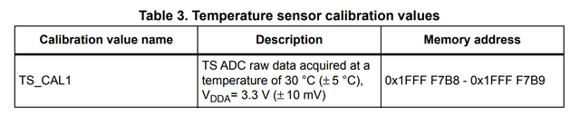
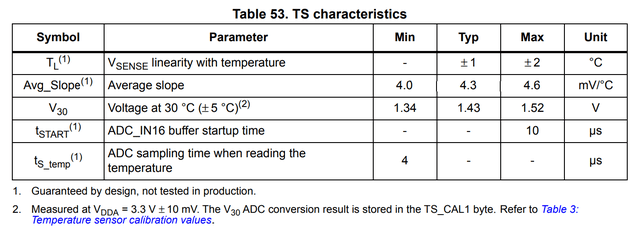

# 3.5: Internal Sensors Calibration

When it comes to temperature measurement, the documented factory
calibration of STM32F030 family members does not provide enough
information to make a valid estimation. The datasheet tells us that the
value stored is the raw data of ADC conversion of the temperature sensor
reading at 3.3V (±10mV) and 30℃ (±5℃).



There is only one point calibration documented and its reference
temperature is known with a precision of ±5℃. That’s not enough to
calculate temperature but it shows that the sensor was tested in
production.

Notice that the calibration value name is **TS_CAL1**, some other STM32
chipset families do have a second temperature factory calibration point
**TS_CAL2**. Also some don’t have any factory calibration stored at all.
So you have to refer to the datasheet that matches the chip you are
targeting when you port your code to a new chipset.



The sensor linearity with temperature is at worst ±2℃. So I am curious
to see how it performs over a range of temperature.

If you are so lucky that you have picked a STM32F030 chip that has the
typical average slope of **4.3 mV/℃** and was calibrated in factory at
exactly **3.3V** and **30℃**, then you could use the following formula
to calculate the temperature.

**T = 30 + (TS_CAL1 * 3.3 – TS_RAW * VDDA) / 4095 / 0.0043**

with

**VDDA = 3.3 * VREFINT_CAL / V_RAW**

that gives

**T = 30 + 3.3 * (TS_CAL1 – TS_RAW * V_CAL / V_RAW) / 4095 / 0.0043**

If I express the average slope in raw ADC units per ℃ instead of mV/℃

**5.336 = 4095 * 0.0043 / 3.3**

the final formula is

**T = 30 + (TS_CAL1 – TS_RAW * V_CAL / V_RAW) * 1000 / 5336**

which matches the sample code for temperature computation given in the
reference manual.

```c
/* Temperature sensor calibration value address */
#define TEMP30_CAL_ADDR ((uint16_t*) ((uint32_t) 0x1FFFF7B8))
#define VDD_CALIB ((uint32_t) (3300))
#define VDD_APPLI ((uint32_t) (3000))
#define AVG_SLOPE ((uint32_t) (5336)) /* AVG_SLOPE in ADC conversion step
                                      (@3.3V)/°C multiplied by 1000 for
                                      precision on the division */
int32_t temperature; /* will contain the temperature in degrees Celsius */
temperature = ((uint32_t) *TEMP30_CAL_ADDR
            - ((uint32_t) ADC1->DR * VDD_APPLI / VDD_CALIB)) * 1000;
temperature = (temperature / AVG_SLOPE) + 30;
```

If I use the raw ADC readings from my last run

**VDDA = 3.3 * 1525 / 1518 = 3.315V**

**t = 30 + (1742 – 1760 * 1525 / 1518) * 1000 / 5336 = 25.2℃**

I confirm the voltage with a voltmeter (actual 3.323V versus 3.315V
computed) but the temperature value seems too high even considering that
this is the internal chip temperature and not the room temperature
(temperature of the chip casing measured at 22.8℃).

## Undocumented calibration data

For the STM32F030Fx, the 5KB space before the RAM contains the System
Memory (3KB) and the option bytes.

| Content       | Start Address | Size |
|---------------|:-------------:|------|
| System Memory | 0x1FFFEC00    | 3KB  |
| Option Bytes  | 0x1FFFF800	| 2KB  |
| RAM Memory	| 0x20000000    | 4KB  |

The calibration data are saved in the last 96 bytes of the System
Memory, starting at address 0x1FFFF7A0. So it’s simple to dump the
content of that zone and compare the values for multiple chips.

```
$ stm32flash -r - -S 0x1FFFF7a0:96 COM6 2>/dev/null | hexdump -C
00000000  ff ff ff ff 31 00 10 00  ff ff ff ff 14 80 20 00  |....1......... .|
00000010  13 57 33 52 31 37 31 20  ce 06 f5 05 f0 ff ff ff  |.W3R171 ........|
00000020  ff ff 27 05 ff ff ff ff  fc ff ff ff 10 00 ff ff  |................|
00000030  ff ff ff ff ff ff ff ff  ff ff ff ff ff ff ff ff  |................|
00000040  ff ff ff ff ff ff ff ff  f3 ff ff ff ff ff ff ff  |................|
00000050  ff ff ff ff ff ff ff ff  68 97 64 9b 3c c3 3f c0  |........h.d.<.?.|
00000060
```

| Location   | Content         | Size | F030 | F0x1/2/8 |
|------------|:---------------:|-----:|:----:|:--------:|
| 0x1FFFF7AC | Unique ID       | 12   |	     | √        |
| 0x1FFFF7B8 | TS_CAL1         | 2    |	√    | √        |
| 0x1FFFF7BA | VREFINT_CAL     | 2    |	√    | √        |
| 0x1FFFF7C2 | TS_CAL2         | 2    |      | √        |
| 0x1FFFF7CC | Flash size (KB) | 2    |	√    | √        |

This is the same layout as the one documented in RM0091 Reference Manual
STM32F0x1/STM32F0x2/STM32F0x8 which includes the following sample code
for temperature computation.

```c
/* Temperature sensor calibration value address */
#define TEMP110_CAL_ADDR ((uint16_t*) ((uint32_t) 0x1FFFF7C2))
#define TEMP30_CAL_ADDR ((uint16_t*) ((uint32_t) 0x1FFFF7B8))
#define VDD_CALIB ((uint16_t) (330))
#define VDD_APPLI ((uint16_t) (300))
int32_t temperature; /* will contain the temperature in degrees Celsius */
temperature = ((int32_t) ADC1->DR * VDD_APPLI / VDD_CALIB)
            - (int32_t) *TEMP30_CAL_ADDR;
temperature *= (int32_t)(110 - 30);
temperature /= (int32_t)(*TEMP110_CAL_ADDR - *TEMP30_CAL_ADDR);
temperature += 30;
```

Factoring in the actual measured voltage, this gives

**T = 30 + (TS_CAL1 – TS_RAW * V_CAL / V_RAW) * 80 / (TS_CAL1 – TS_CAL2)**

If I use the raw ADC readings from my last run

```
TSCAL2_SLOPE = (1742 - 1319) / 80 = 5.287 ADC step/℃
             = 3.3 * 5.287 / 4095 = 4.26 mV/℃
```

**t = 30 + (1742 – 1760 * 1525 / 1518) * 80 / (1742 – 1319) = 25.1℃**

Which is only .1℃ lower than the previous result based on the more
generic formula.

## Securing stable ADC readings

Before cranking up the temperature, it is worth to check how the ADC
readings behave at a stable temperature. Are they steady or do they
fluctuate?

The temperature affects the clocks, the power conversion and the sensors
response linearity. Inevitably, some fluctuation will appear during the
calibration as I increase or drop the temperature. If at stable room
temperature there is already strong fluctuations, the cause of those
fluctuations need to be identified and fixed before any calibration can
be done.

● **ADC Sampling Clock**

The ADC sampling clock is maximum 14MHz and can take HSI14, PCLK/2 or
PCLK/4 as a source. In my experience, ADC readings done with HSI14 are
too noisy while I can secure stable readings with PCLK/2 as input with a
PLL output between 16 and 28MHz using either HSI or an 8MHz HSE clock.

I didn’t investigate further what is the issue with HSI14 as I am not
doing any advanced use of the ADC at this stage.

● **ADC temperature channel startup time**

Both reference voltage and temperature sensor characteristics give a
minimum ADC sampling time of 4µs. With an ADC sampling frequency at
14MHz, this means 56 ADC sampling clock cycles.

A corresponding value needs to be set in the ADC Sampling Time Register
according to the ADC sampling clock frequency (ADC_SMPR, 6 => 71.5 ADC
sampling clock cycles). Picking up the maximum value of 7 (17.1µs or
239.5 ADC sampling clock cycle) is fine for a calibration application.

● **Warm up**

The internal temperature sensor measures the chip temperature, so there
is a warm up time after a cold start during which the temperature will
settle. Accordingly when the external temperature changes, there will be
some delay before the effects of the changes are fully reflected in the
measurements.

To minimize the effect of heat dissipation, I will avoid using the PLL
and select HSI as main CPU clock. I will also turn off the peripherals
when not in use, which means switching off the ADC peripheral clock
between readings. My code already yield() when it is waiting for the
next sampling time, going to stand by mode on the other hand is not
something I want to do at this stage.

● **Power supply**

All ADC conversions are relative to VDDA value. It is worth to
understand how the board hardware follows ST Micro recommended design
and to make use of a reliable power source. This also means the
reference voltage readings need to be tuned before the temperature ones.

## Calibration Application

At this stage I have two open questions:

- Can I rely on the factory calibrations or should I make my own?

- How to make a second point calibration for the temperature sensor?

I am using a DS18B20 as a reference while tracking the minimum and
maximum values acquired so far. Because the DS18B20 and the STM32F030
have a different latency in picking up temperature changes, they won’t
be strictly aligned at a given time if the temperature keeps changing.

```c
/* adccalib.c -- ADC calibration of internal temperature sensor */

#include <stdio.h>
#include "system.h"     /* uptime, adc_vnt() */
#include "ds18b20.h"    /* ds18b20_() */

#define ABS( i) ((i < 0) ? -i : i)

static void track( short *minp, short *maxp, short val) {
    if( val < *minp)
        *minp = val ;

    if( val > *maxp)
        *maxp = val ;
}

int main( void) {
    unsigned last = 0 ;
    short calV, calC ;
    short minC, maxC ;  /* Track temperature from DS18B20 */
    short minV, maxV ;  /* Track ADC raw Vref */
    short minT, maxT ;  /* Track ADC raw Tsense */

    minC = minV = minT = 0x7FFF ;
    maxC = maxV = maxT = -32768 ;

/* Initialize ADC and fetch calibration values */
    adc_vnt( VNT_INIT, &calV, &calC) ;
    printf( "%u, %u\n", calV, calC) ;
    int tconst = 6660 * calV / calC ;

/* Initialize DS18B20 and initiate temperature conversion */
    ds18b20_init() ;
    ds18b20_resolution( 12) ;   /* Set highest resolution: 12 bits */
    ds18b20_convert() ;         /* start temperature conversion */

/* main acquisition loop, reads samples every seconds */
    for( ;;)
        if( uptime == last)
            yield() ;
        else {
            short Vsample, Csample ;

            last = uptime ;

        /* Track DS18B20 temperature readings */
            switch( ds18b20_fetch( &Csample)) {
            case DS18B20_SUCCESS:
                track( &minC, &maxC, Csample) ;
                printf( "%i.%i, %i, %i, ", Csample / 10, ABS( Csample % 10),
                                                                minC, maxC) ;
                break ;
            case DS18B20_FAIL_TOUT:
                printf( "Timeout, ") ;
                break ;
            case DS18B20_FAIL_CRC:
                printf( "CRC Error, ") ;
            }

            ds18b20_convert() ; /* start temperature conversion */

        /* Track Internal Temperature Sensor readings */
            adc_vnt( VNT_RAW, &Vsample, &Csample) ;
            track( &minV, &maxV, Vsample) ;
            track( &minT, &maxT, Csample) ;
            printf( "%i, %i, %i, %i, %i, %i, %i, %i, ",
                    calV, Vsample, minV, maxV,
                    calC, Csample, minT, maxT) ;
            Csample = 3630 - (1 + tconst * Csample / Vsample) / 2 ;
            Vsample = (660 * calV / Vsample + 1) / 2 ;
            printf( "%i.%i, %i.%i\n",   Vsample / 100, ABS( Vsample % 100),
                                        Csample / 10, ABS( Csample % 10)) ;
        }
}
```

The composition in Makefile

`SRCS = startup.txeie.c adc.c adccalib.c ds18b20.c`

Build succeeds with a warning for the baud rate calculation as I am
using HSI 8MHz as main clock. This will not affect execution as the
difference is small for 9600 baud.

```
$ make
adc.c:205:3: warning: #warning baud rate not accurate at that clock frequency [-Wcpp]
  205 | # warning baud rate not accurate at that clock frequency
      |   ^~~~~~~
f030f4.elf
   text    data     bss     dec     hex filename
   3320       0      16    3336     d08 f030f4.elf
f030f4.hex
f030f4.bin
```

I use **PuTTY** to capture a log of the output: **ds18b20**
(temperature, minimum, maximum), **reference voltage** (ADC calibration,
current, min, max and voltage), **temperature sensor** (ADC calibration,
current, min, max and temperature).

```
22.0, 218, 226, 1518, 1522, 1521, 1525, 1754, 1777, 1775, 1783, 3.29, 26.6
22.0, 218, 226, 1518, 1523, 1521, 1525, 1754, 1778, 1775, 1783, 3.29, 26.6
22.0, 218, 226, 1518, 1523, 1521, 1525, 1754, 1778, 1775, 1783, 3.29, 26.6
22.0, 218, 226, 1518, 1523, 1521, 1525, 1754, 1778, 1775, 1783, 3.29, 26.6
22.0, 218, 226, 1518, 1523, 1521, 1525, 1754, 1778, 1775, 1783, 3.29, 26.6
22.0, 218, 226, 1518, 1524, 1521, 1525, 1754, 1779, 1775, 1783, 3.29, 26.6
22.0, 218, 226, 1518, 1522, 1521, 1525, 1754, 1777, 1775, 1783, 3.29, 26.6
```

## Experiments

With the operating range of temperature being -40℃ … 85℃, I can conduct
two experiments: heating and cooling.

- **Heat**: I can use a small heater to raise the temperature to ~50℃.

- **Cold**: I can put the device in a fridge (~4℃) or freezer (~-18℃).

This would allow me to make my own two point temperature calibration at
~-18℃ and ~50℃. I’ll have to do this for several chips to understand how
they compare. Then I would be able to see if there is any benefit
compare to using the factory calibration values.

I do the heat experiment with the calibration application I just
explained. To do the cold experiment, I use a display instead of the
asynchronous serial transmission of the readings.

|                 | DS18B20 | Vrefint | TSense | Vmeasured |
|-----------------|---------|---------|--------|-----------|
| Calibration 30  |         | 1526    | 1721   |           |
| Calibration 110 |         |         | 1297   |           |
| Room 19.4℃      |  19.4   | 1534    | 1761   | 3.287     |
| Freezer ~18℃    |	-18.5   | 1539    | 1972   |           |
| Heater 40℃      |         | 1532    |        |           |

I exclude the temperature readings from the heater experiment as I
didn’t manage to setup a stable equal distribution of the heat between
the sensors.

The voltage ADC readings varies from 1532 to 1539 for a range of
temperature of at least 55℃. The voltage reading at room temperature
confirms that the factory voltage calibration is reliable (measured
3.287V versus calculated 3.283V).

The difference of temperature measured between the room and freezer is
37.9℃ which is nearly a third of the operation range [-40 … 85]℃. So I
use those two measurements for my two point calibration.

```
AVG_SLOPE = (1972/1539 - 1761/1534) * 1526 / 37.9
          = 5.370 ADC_steps/℃
          = 4.327 mV/℃
```

This is very close to the Temperature Sensor typical characteristic of
4.3mV/℃ for the average slope.

As a reference, the average slope using the undocumented TS_CAL2 value

```
TSCAL2_SLOPE = (1721 - 1297) / 80
             = 5.3 ADC_steps/℃
             = 4.271 mV/℃
```

Now that I know the average temperature slope, I can calculate the
temperature that matches the factory calibration value.

```
Tfactory30  = (1972 * 1526/1539 - 1721) / 5.37 - 18.5 =  25.1℃
Tfactory30  = (1761 * 1526/1534 - 1721) / 5.37 + 19.4 =  25.1℃
Tfactoty110 = (1972 * 1526/1539 - 1297) / 5.37 - 18.5 = 104.1℃
Tfactory30  = (1761 * 1526/1534 - 1297) / 5.37 + 19.4 = 104.1℃
DeltaT = 104.1 - 25.1 = 79℃
```

If I repeat the same experiments with another board

|                 | DS18B20 | Vrefint | TSense | Vmeasured |
|-----------------|---------|---------|--------|-----------|
| Calibration 30  |         | 1521    | 1764   |           |
| Calibration 110 |         |         | 1333   |           |
| Room 19.4℃      |  23.0   | 1504    | 1752   | 3.340     |
| Freezer ~18℃    |	-17.7   | 1505    | 1961   |           |

```
AVG_SLOPE = (1961/1505 - 1752/1504) * 1521 / 40.7
          = 5.160 ADC_steps/℃
          = 4.158 mV/℃
```

```
TSCAL2_SLOPE = (1764 - 1333) / 80
             = 5.3875 ADC_steps/℃
             = 4.341 mV/℃
```

```
Tfactory30 = (1961 * 1521/1505 - 1764) / 5.16 - 17.7 = 24.5℃
Tfactory30 = (1752 * 1521/1504 - 1764) / 5.16 + 23.0 = 24.5℃
Tfactory110 = (1961 * 1521/1505 - 1333) / 5.16 - 17.7 = 108.8℃
Tfactory110 = (1752 * 1521/1504 - 1333) / 5.16 + 23.0 = 108.0℃
DeltaT = 108.8 - 24.5 = 84.3℃
```

Both experiments shows that the temperature calibration value TS_CAL1
and TS_CAL2 are roughly 80℃ apart.

## Checkpoint

At this point I have been tinkering for a while with ADC conversion and
the internal temperature sensor. I am not doing any advanced use of the
ADC peripheral but the current minimal set up is stable. My main drive
in investigating the internal temperature sensor is that on one hand it
seems a technically reliable solution but on the other hand I can’t find
a practical use of it published anywhere. By doing a two point
calibration, I can have a good estimation of the average slope for the
response to temperature of a specific chip. Still I cannot link exactly
my measurements with the factory temperature calibration data. I don’t
have clear information on the factory conditions in which those data are
collected and I need more samples to draw my own conclusion.

Once I have collected calibration data of more chips, I will update this
page with my findings.

I have not included here the display code I have been using in the cold
experiment, I will explain that later in the display section.

[Next]( 36_update) I will cover the toolchain update that I made while
working on the temperature sensors.

___
© 2020-2021 Renaud Fivet
