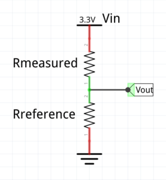

# 3.9: Reading a Resistor Value

I used the ADC previously to read the internal sensors, so it’s simple
to move on to external ones. Once you can read the value of a resistor,
there is a wide choice of analog applications: thermistors, photocells,
potentiometers, sliders, joysticks …

## Voltage Divider Circuit



**Vout = Vin * Rref / (Rref + Rmeasured)**

## ADC Readings

Assuming the ADC is configured for 12 bit precision and return a value
in the range [0 … 4095]

**Vout = VADC = VDDA * ADCRAW / 4095**

**Vin = VDDA**

**~VDDA~ * ADCRAW / 4095 = ~VDDA~ * Rref / (Rref + Rmeasured)**

**ADCRAW * Rmeasured = Rref * (4095 – ADCRAW)**

**Rmeasured = Rref * (4095 – ADCRAW) / ADCRAW**

**Rmeasured = Rref * (4095 / ADCRAW – 1)**

## Devil in the whatnots

- Avoiding division by zero.

- Integer versus floating point calculation.

- Choosing the reference resistor.

- Calibration of the reference resistor.

```c
#include <limits.h>
int R = ADCraw ? Rref * (4095 / ADCraw - 1) : INT_MAX ;
```

`int R = ADCraw ? Rref * 4095 / ADCraw - Rref : INT_MAX ;`

___
© 2020-2021 Renaud Fivet
