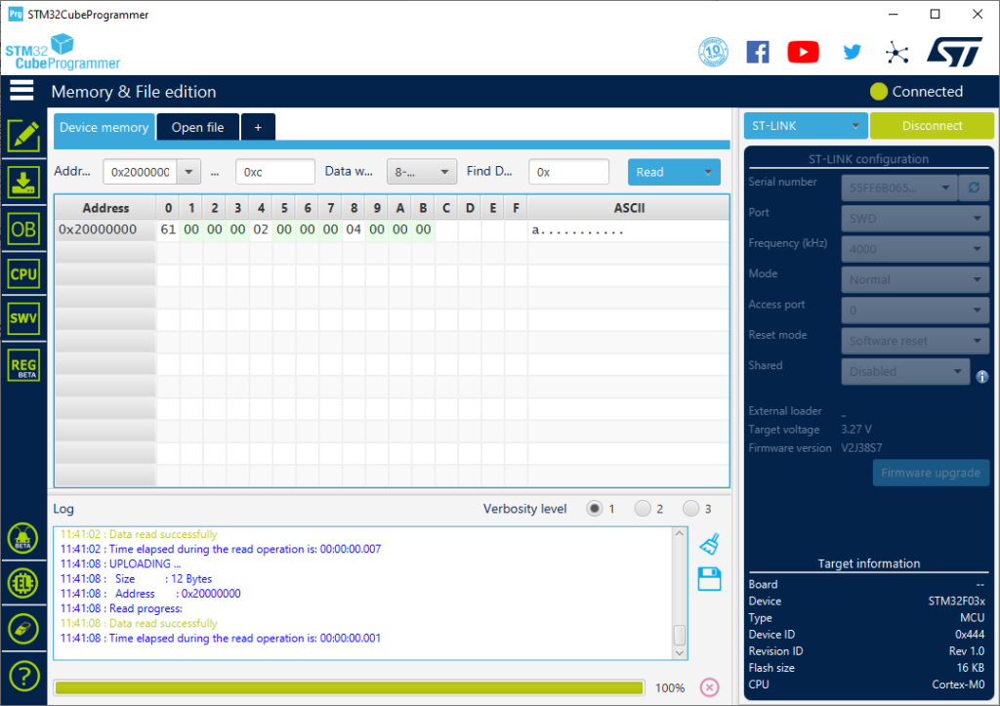

# 1.7: C Startup

The C compiler uses a memory model where the RAM is divided into four
contiguous sections. The linker provides the symbols needed to make sure
the initial state meet the requirement of this memory model. So I need
to write a piece of code to use those symbols to initialize or clear the
RAM accordingly.

| Section | Description                                  |
|--------:|----------------------------------------------|
| data    | static initialized, initial value in flash   |
| bss     | static unassigned, cleared                   |
| heap    | dynamically allocated, user managed          |
| stack   | automatically allocated, stack frame managed |

My bootstrap since the first **boot.c** already initializes the stack. I
need now to copy the initial values from flash to the data section and
clear the bss section.

You can check your understanding of the C memory model by looking at the
C test code below and figuring where the linker will allocate the
variables.

```c
/** Test code: main.c *********************************************************/

const char hexa[] = "0123456789abcdef" ;
long first = 1 ;
long i ;

int main( void) {
    static char c = 'a' ;
    char *cp = &c ;

    *cp += i ;
    i += hexa[ 13] - c + first++ ;
    return 0 ;
}
```

- **data** section holds `first` and `c`, for a total of 8 bytes as
sections are word aligned.

- **bss** section holds `i` for a total of 4 bytes.

- **text** section holds `hexa` with all the const data located after
the code. As it is a zero terminated string, it occupies 17 bytes and is
padded with 3 zero for word alignment.

- **text** section holds the initial value of `first` and `c` for a
total of 8 bytes located after the const data.

- **stack** section holds `cp`, it is dynamically managed by the code
generated by the C compiler.

- after executing `main()`, `hexa` and `c` are unchanged, `first` has the
value 2, `i` has the value 4 and `cp` has been deallocated.

## Evolving the bootstrap

First I make a copy of **boot.c** into **cstartup.c**.

I add the symbols defined by the linker:

- `__etext`, start of initial value copy in FLASH.

- `__data_start`, start of initialized data in RAM.

- `__bss_start`, start of unitialized data in RAM, it is the same
location as `__data_end`.

- `__bss_end`, first location after the bss section.

I rework `Reset_handler()` to:

- Initialize the **data** section with the initial values stored in flash.

- Clear the **bss** section

- Call the `main()` C function.

- Fallback to idle loop after `main()` has been executed.

Finally I append the test code for validation.

```c
/* Memory locations defined by linker script */
extern long __StackTop ;        /* &__StackTop points after end of stack */
void Reset_Handler( void) ;     /* Entry point for execution */
extern const long __etext[] ;   /* start of initialized data copy in flash */
extern long __data_start__[] ;
extern long __bss_start__[] ;
extern long __bss_end__ ;       /* &__bss_end__ points after end of bss */

/* Interrupt vector table:
 * 1  Stack Pointer reset value
 * 15 System Exceptions
 * NN Device specific Interrupts
 */
typedef void (*isr_p)( void) ;
isr_p const isr_vector[ 2] __attribute__((section(".isr_vector"))) = {
    (isr_p) &__StackTop,
/* System Exceptions */
    Reset_Handler
} ;


extern int main( void) ;

void Reset_Handler( void) {
    const long  *f ;    /* from, source constant data from FLASH */
    long    *t ;        /* to, destination in RAM */

/* Assume:
**  __bss_start__ == __data_end__
**  All sections are 4 bytes aligned
*/
    f = __etext ;
    for( t = __data_start__ ; t < __bss_start__ ; t += 1)
        *t = *f++ ;

    while( t < &__bss_end__)
        *t++ = 0 ;

    main() ;
    for( ;;) ;
}

/** Test code: main.c *********************************************************/

const char hexa[] = "0123456789abcdef" ;
long first = 1 ;
long i ;

int main( void) {
    static char c = 'a' ;
    char *cp = &c ;

    *cp += i ;
    i += hexa[ 13] - c + first++ ;
    return 0 ;
}
```

## Build

Building a binary, I can see that the **data** and **bss** section are
not empty anymore and their size match my estimations.

```
$ make cstartup.bin
cstartup.elf
   text    data     bss     dec     hex filename
    121       8       4     133      85 cstartup.elf
cstartup.hex
rm cstartup.o cstartup.elf
```

If I look further in the **cstartup.map** generated by the linker.

```
.text           0x08000000       0x79
 *(.isr_vector)
 .isr_vector    0x08000000        0x8 cstartup.o
                0x08000000                isr_vector
 *(.text*)
 .text          0x08000008       0x34 cstartup.o
                0x08000008                Reset_Handler
 .text.startup  0x0800003c       0x2c cstartup.o
                0x0800003c                main
 *(.rodata*)
 .rodata        0x08000068       0x11 cstartup.o
                0x08000068                hexa
.data           0x20000000        0x8 load address 0x0800007c
                0x20000000                __data_start__ = .
 *(.data*)
 .data          0x20000000        0x8 cstartup.o
                0x20000004                first
                0x20000008                . = ALIGN (0x4)
                0x20000008                __data_end__ = .
.bss            0x20000008        0x4 load address 0x08000084
                0x20000008                . = ALIGN (0x4)
                0x20000008                __bss_start__ = .
 *(.bss*)
 .bss           0x20000008        0x0 cstartup.o
 *(COMMON)
 COMMON         0x20000008        0x4 cstartup.o
                0x20000008                i
                0x2000000c                . = ALIGN (0x4)
                0x2000000c                __bss_end__ = .
 *(.stack*)
                0x20001000                __StackTop = (ORIGIN (RAM) + LENGTH (RAM))
```

- `hexa` is located in **.rodata** at 0x08000068

- `first` is located in **.data** at 0x20000004

- `i` is located in **.bss** at 0x20000008

- `c` is not listed as it doesn’t have global scope, but we can guess
it’s located at 0x20000000.

- Initial values for the **.data** section are located at 0x0800007c.

A hexadecimal dump of **cstartup.bin** confirms that the initial value
of `c` is at offset 0x7c, which also means that `c` has been located at
0x20000000.

```
$ hexdump -C cstartup.bin
00000000  00 10 00 20 09 00 00 08  10 b5 08 4a 08 4b 09 49  |... .......J.K.I|
00000010  8b 42 06 d3 00 21 08 4a  93 42 05 d3 00 f0 0e f8  |.B...!.J.B......|
00000020  fe e7 01 ca 01 c3 f3 e7  02 c3 f5 e7 7c 00 00 08  |............|...|
00000030  00 00 00 20 08 00 00 20  0c 00 00 20 30 b5 08 49  |... ... ... 0..I|
00000040  08 4c 08 68 23 78 1b 18  da b2 63 68 22 70 5d 1c  |.L.h#x....ch"p].|
00000050  9b 1a 64 33 1b 18 65 60  00 20 0b 60 30 bd c0 46  |..d3..e`. .`0..F|
00000060  08 00 00 20 00 00 00 20  30 31 32 33 34 35 36 37  |... ... 01234567|
00000070  38 39 61 62 63 64 65 66  00 00 00 00 61 00 00 00  |89abcdef....a...|
00000080  01 00 00 00                                       |....|
00000084
```

## Debug

I use the STM32 Cube Programmer to check that the code behaves as
expected by checking the RAM state after `main()` has been executed.



## Checkpoint

I have now a sample bootstrap that puts the RAM memory in a state
required for a C startup.

[Next](18_3stages) I will merge the C startup initialization with the
ledtick code.

___
© 2020-2021 Renaud Fivet
