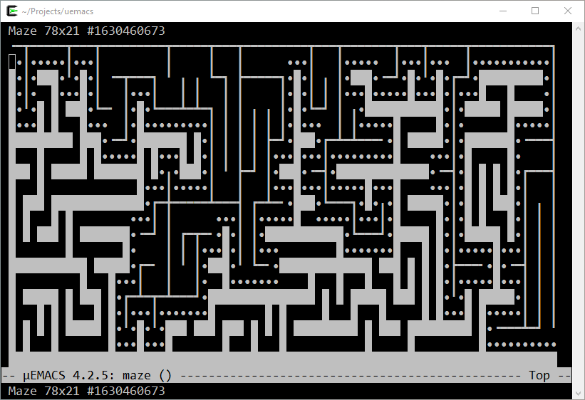

# µEMACS

**µEMACS** (ue) based on uEmacs/PK (em) from
[kernel.org](https://git.kernel.org/pub/scm/editors/uemacs/uemacs.git/).
Latest version built and tested on Cygwin, Ubuntu Linux and NetBSD.

[Quick build and install](quick.html)

___
© 2020-2021 Renaud Fivet
